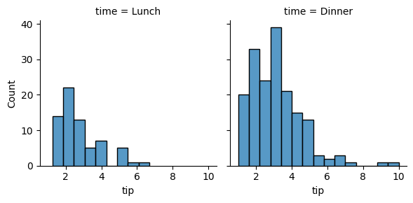
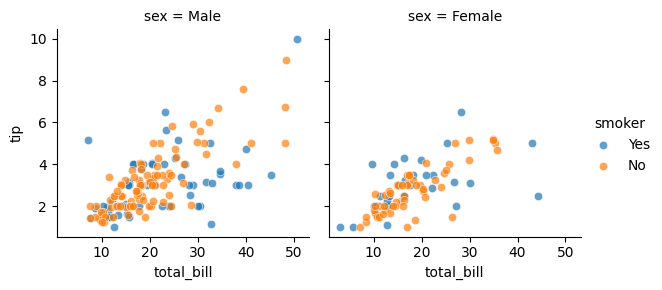
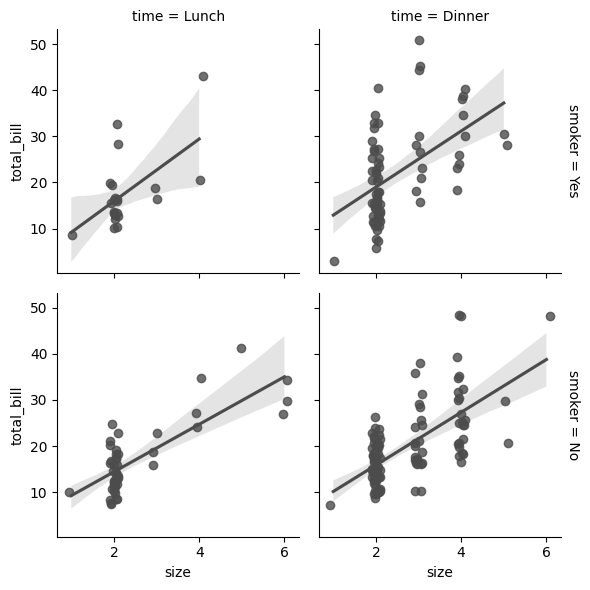

```python
import numpy as np
import pandas as pd
import matplotlib.pyplot as plt
import seaborn as sns
```


```python
tips = sns.load_dataset("tips")
g = sns.FacetGrid(tips, col="time")
g.map(sns.histplot, "tip")
```


    <seaborn.axisgrid.FacetGrid at 0x1b9ad0a3a30>


    

    


```python
g = sns.FacetGrid(tips, col="sex", hue="smoker")
g.map(sns.scatterplot, "total_bill", "tip", alpha=.7)
g.add_legend()
```


    <seaborn.axisgrid.FacetGrid at 0x1b9ad9e8bb0>


    

    


```python
g = sns.FacetGrid(tips, row="smoker", col="time", margin_titles=True)
g.map(sns.regplot, "size", "total_bill", color="0.3", fit_reg=True, x_jitter=.1)
```


    <seaborn.axisgrid.FacetGrid at 0x1b9adad41f0>


    

    


```python

```
